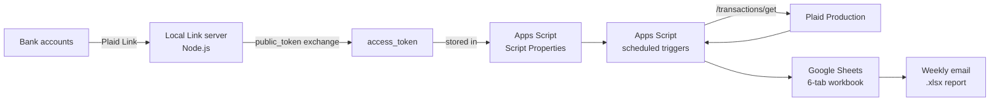
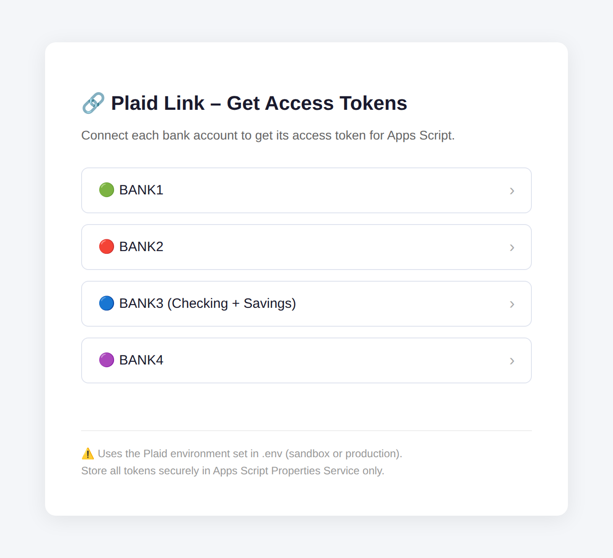

<p align="center">
  
</p>

# MyLedger 💰

**Built March 2026. Ran on live bank data twice a week through August 2026. Published here October 2026.**

A personal finance tracker that pulls real bank transactions through the **Plaid API** into **Google Sheets**, categorizes them with **Google Apps Script**, and emails a weekly spending report. No servers to run, no manual statement downloads.

I built MyLedger to replace a budgeting spreadsheet I was updating by hand. My Plaid Production application was approved in mid-March 2026, and from then until August the script fetched my transactions twice a week. The runs used Plaid's free API allowance; when the call cap ran out on Aug 26, 2026, I paused fetching rather than move to paid usage.

---

## What it does

- Connects **4 Plaid Items** (credit card, checking and savings accounts)
- Fetches new transactions **twice a week** on time-driven triggers, deduplicated on Plaid's `transaction_id`
- Maps every transaction into one of **12 budget categories** with ordered rules (the rules in this repo are representative examples)
- Normalizes Plaid's sign convention so income shows as positive
- Builds a **Weekly_View** (Sunday through Saturday) with per-category breakdowns
- Builds a **Dashboard** tab with KPI cards, a budget-vs-actual table and a donut chart
- Fills a **monthly budget tab** with Actual, Remaining and Take Home per category
- Emails a **Sunday report** with the workbook attached as `.xlsx`
- Emails a **month-end reminder** to roll over to a new workbook
- Has a **pause switch** (`PLAID_PAUSED`) that stops every Plaid call without touching code or triggers

---

## Architecture



**Why a local Link server?** Plaid Link has to run in a browser, and the token exchange (`/item/public_token/exchange`) must happen server-side with your secret. Calling Plaid directly from a browser is blocked by CORS, and you should never ship a secret to the client anyway. A tiny local Node.js server handles `link_token` creation and the exchange once per bank connection. After that, Apps Script does everything on its own.

<p align="center">
  
</p>

The page shows each `access_token` so it can be pasted into Script Properties. That's fine for a local, single-user tool; in a multi-user app the access token never leaves the server.

---

## Tech stack

| Layer | Tool |
|---|---|
| Bank data | Plaid API (`/transactions/get`), Production environment |
| Account linking | Plaid Link + local Node.js / Express server |
| Automation | Google Apps Script (V8, time-driven triggers) |
| Secrets | Apps Script Script Properties (`PropertiesService`), local git-ignored `.env` |
| Data + reporting | Google Sheets, Gmail (`MailApp`) |

---

## Repo layout

```
apps-script/   the Apps Script project, split by area, plus appsscript.json
link-server/   one-time Plaid Link + token exchange (server.js, plaid_link.html)
docs/          sheet schema, Plaid access walkthrough, screenshot
```

The project ran as a single `Code.gs`. It's split into files here for reading; Apps Script shares one global scope across files, so it runs the same either way.

---

## Workbook structure

| Tab | Purpose |
|---|---|
| `Plaid_Transactions` | Raw fetched transactions: Date, Merchant, Amount, My_Category, Plaid_Category, Account, Plaid_ID, Mine_Family, Split_Pct, Notes |
| `Manual_Transactions` | Cash and anything Plaid can't see, entered by hand |
| `All_Transactions` | Sorted view of `Plaid_Transactions` via a `QUERY` formula |
| `Weekly_View` | Sunday to Saturday weeks with category subtotals |
| `Dashboard` | KPI cards, budget-vs-actual table, donut chart (created by the script) |
| `Mar_2026` | Monthly budget tab: budget vs actual per category, income, take home |

Column-by-column details are in [docs/sheet-schema.md](docs/sheet-schema.md).

---

## Key functions

| File | Function | What it does |
|---|---|---|
| `Setup.gs` | `setup_properties` | One-time setup that writes Plaid credentials and tokens into Script Properties |
| `Setup.gs` | `onOpen`, `menu_*` | The **💰 MyLedger** custom menu |
| `Fetch.gs` | `fetchTransactions` | Trigger entry point: fetch, rebuild the views, Sunday email, month-end check |
| `Fetch.gs` | `runFetch` | Calls `/transactions/get` per Item, skips pending and already-seen `transaction_id`s, categorizes, writes rows |
| `Fetch.gs` | `getDateRange` | The Wednesday / Sunday fetch windows |
| `Fetch.gs` | `test_fetch` | Clears and refetches the current month for testing |
| `Categories.gs` | `mapCategory` | Ordered substring rules that map a transaction to a budget category |
| `Categories.gs` | `normalizeAmount` | Fixes Plaid's sign convention for paychecks |
| `WeeklyView.gs` | `updateWeeklyView` | Weekly blocks with category breakdowns and totals |
| `Dashboard.gs` | `updateDashboard` | KPI cards, category table and donut chart |
| `Budget.gs` | `setupBudgetTemplate`, `updateBudgetSheet` | Builds and fills the monthly budget tab |
| `Reports.gs` | `emailReport` | Sunday `.xlsx` export and email |
| `Reports.gs` | `checkMonthEnd`, `setup_new_month` | Month-end reminder and reset |
| `Utils.gs` | `toDateStr_` | Timezone-safe date strings |

### Fetch schedule

Two time-driven triggers, both running `fetchTransactions`:

| Trigger | Fetches |
|---|---|
| Wednesday 8:00 AM PT | The previous Sunday through Tuesday |
| Sunday 8:00 AM PT | Wednesday through Saturday, then sends the weekly email |

Every run also rebuilds Weekly_View, the budget tab and the Dashboard, then calls `checkMonthEnd`.

---

## Data handling decisions

This is the part that took the most iteration, and the part I'd point anyone integrating Plaid toward first.

**1. Plaid's sign convention.** Plaid reports outflows as positive and inflows as negative. That's correct from an accounting view, but it makes income look like a negative number in a budget. Paycheck transactions are flipped with `Math.abs()` so they display as positive income.

**2. Not all money movement is spending.** Transfers between my own accounts (including automated "vault" style moves inside a savings account) were showing up as expenses and inflating totals. These map to `Transfer`. `Transfer`, `Paycheck` and `Investments` are still shown as rows for visibility but left out of the spending totals on Weekly_View, the Dashboard and the budget tab.

**3. Which description field to show.** Plaid's enriched `merchant_name` is great when it's right, but for some transactions it was too generic to tell what the charge was. Requesting `include_original_description: true` and filling the Merchant column with

```js
tx.original_description || tx.merchant_name || txName
```

made rows much easier to identify. Raw bank strings are uglier but far more consistent. (The category rules still match on `merchant_name`; see Known issues.)

**4. Deduplication and pending transactions.** Manual fetches from the menu can overlap the scheduled ones, so every row stores Plaid's `transaction_id` and `runFetch` skips anything already present. Pending transactions are skipped and picked up after they post (under their own `transaction_id`), as long as a later window covers them; see Known issues.

**5. Timezones.** Sheets can hand back `Date` objects that shift across UTC midnight, which mis-sorted weeks early on. The fix: every date is normalized to a `yyyy-MM-dd` string in `America/Los_Angeles`, string dates are pinned to noon UTC before formatting so the calendar day can't flip, week keys are zero-padded, and weeks sort with `localeCompare`. Weekly_View sorted correctly from then on.

**6. Running against a call cap.** Plaid counts failed calls against a call cap too, so a broken trigger can burn through it. `runFetch` checks a `PLAID_PAUSED` Script Property before every run; when the free allowance ran out, flipping it to `true` stopped all calls without touching code, triggers or tokens.

---

## Getting Plaid access: the path I took

1. **Sandbox.** Built and tested the full fetch, categorize and write pipeline against simulated institutions.
2. **Link flow.** Built the local Node.js server to create a `link_token`, open Plaid Link and exchange the `public_token` for a long-lived `access_token` server-side, once per bank.
3. **Production application.** Requested full Production access through the Dashboard: an application profile (even for a single-user project), a security questionnaire, and short security, access control, privacy and data retention policies. Approved in mid-March 2026.
4. **Live.** Swapped to Production keys, re-ran Link against my real institutions, moved the tokens into Script Properties, and turned on the triggers.
5. **Call cap.** Ran on Plaid's free API allowance until it ran out on Aug 26, 2026, then paused.

The full walkthrough, with what the application asks about, is in [docs/plaid-access-process.md](docs/plaid-access-process.md).

> **Note for new developers:** Plaid teams created on or after April 15, 2026 in the US and Canada get a free Trial plan for testing with real data, in place of Limited Production. Check the [Plaid docs](https://plaid.com/docs/) for the current limits.

**Takeaway:** the questionnaire was easier to answer honestly once the architecture was simple. Everything lives inside Google's managed environment (encrypted at rest), there are no servers of mine holding data, and there's a clear deletion path: delete the workbook, clear Script Properties, and remove the Items.

---

## Setup (if you want to run your own)

### Prerequisites
- Plaid account with Sandbox keys (and Production or Trial access for real data)
- Google account
- Node.js 20+ (only for the one-time Link step)

### 1. Link your accounts
```bash
cd link-server
cp .env.example .env              # add PLAID_CLIENT_ID, PLAID_SECRET, PLAID_ENV
npm install
node --env-file=.env server.js    # then open http://localhost:3000/plaid_link.html
```
Complete Link for each institution and copy each `access_token` from the page. In Sandbox, log in with `user_good` / `pass_good`.

### 2. Create the workbook
Create a Google Sheet with the tabs `Plaid_Transactions`, `Manual_Transactions`, `All_Transactions` and `Weekly_View` (headers in [docs/sheet-schema.md](docs/sheet-schema.md)). Open **Extensions > Apps Script**, add the files from `apps-script/`, and replace the manifest with `appsscript.json` (turn on "Show appsscript.json" under Project Settings first; it sets the `America/Los_Angeles` timezone). Run `setupBudgetTemplate` once to create the budget tab. The Dashboard tab is created on the first run.

### 3. Store credentials
Add these under **Project Settings > Script Properties**, or put real values into `setup_properties` locally, run it once, then restore the placeholders. Credentials should only ever live in Script Properties.

| Key | Value |
|---|---|
| `PLAID_CLIENT_ID` | From the Plaid Dashboard |
| `PLAID_SECRET` | The secret for the environment you're using |
| `PLAID_ENV` | `sandbox` or `production` |
| `PLAID_TOKEN_BANK1` to `PLAID_TOKEN_BANK4` | Access tokens from step 1 |
| `EMAIL_TO` | Where the Sunday report goes |
| `PLAID_PAUSED` | `true` stops all Plaid calls |

### 4. Add triggers
Create two time-driven, weekly triggers for `fetchTransactions`: Wednesday 8 to 9 AM and Sunday 8 to 9 AM.

### 5. Test
Run `test_fetch` and confirm rows land in `Plaid_Transactions`. Reopen the sheet to get the **💰 MyLedger** menu with the common actions.

---

## Security

- **No credentials in this repo.** `client_id`, `secret` and `access_token`s live only in Apps Script Script Properties and a local, git-ignored `.env`
- Separate secrets per environment (Sandbox vs. Production)
- If a token is ever exposed, rotate it with `/item/access_token/invalidate` (or remove the Item) and rotate the secret in the Dashboard
- Category rules, budget targets and income figures in this repo are representative examples, not my real data
- The only screenshot is the local Link page, which shows no account data

---

## Known issues

Found while preparing this repo. The code here is what ran, so these are documented rather than silently fixed.

- [ ] **Budget tab is pinned to `Mar_2026`.** `setupBudgetTemplate`, `updateBudgetSheet` and the menu look the tab up by that exact name, and the Sunday email body is headed "MARCH SPENDING SUMMARY". Fix: find the tab with the same `[A-Z][a-z]+_\d{4}` pattern `setup_new_month` already uses, and build the heading from the current month.
- [ ] **Fetch windows leave gaps.** The windows don't overlap and never start before the 1st, so a transaction that arrived late, dated inside a window that was already fetched, was never requested again, and the last 1 to 3 days of each month fell outside every scheduled window (for example Jun 28 to 30). When the 1st lands on a run day the window even comes out inverted (Apr 1 to Mar 31 on Wednesday, Apr 1), which still costs a call against the cap. Fix: re-fetch a trailing 14 days on every run (dedupe already drops repeats, and it's still one call per Item), or move to `/transactions/sync`.
- [ ] **Month-end reminder rarely fires.** `checkMonthEnd` only runs inside `fetchTransactions`, so the reminder only goes out when a month ends on a Wednesday or Sunday. From March to August 2026 that happened once (May 31). Without it I never rolled over, so one workbook ran from March to August and the Dashboard, budget tab and email totals became running totals since March instead of monthly ones. Fix: a separate daily trigger for `checkMonthEnd`, or filter totals by month.
- [ ] **All_Transactions columns don't line up.** The `QUERY` returns 8 columns from `Plaid_Transactions`, but the tab has 9 headers laid out for the planned Plaid + manual merge, so Split_Pct lands under Source, Notes under Transaction ID, and Month stays empty.
- [ ] **Smaller mismatches.** The Sunday email counts `Investments` as spending (Weekly_View and the Dashboard don't), and `mapCategory` matches on `merchant_name`, not the raw `original_description` shown in the Merchant column.

## Roadmap

- [ ] Merge `Manual_Transactions` into `All_Transactions` (the headers are already laid out for it)
- [ ] Move to `/transactions/sync` with a stored cursor instead of date windows
- [ ] Move categorization off the deprecated legacy `category` field onto `personal_finance_category`

---

## What building this taught me

Most of the work wasn't calling the API, it was understanding the data that came back: sign conventions, transfers that look like spending, and descriptions that vary by institution. Those are the same questions any developer integrating Plaid runs into, and working through them end to end (Sandbox, Link, the Production review, then live data) is what I'd bring to helping other teams do the same. Writing this up also surfaced the fetch-window gaps above, which is exactly the problem cursor-based `/transactions/sync` exists to solve.

---

## License

[MIT](LICENSE)
